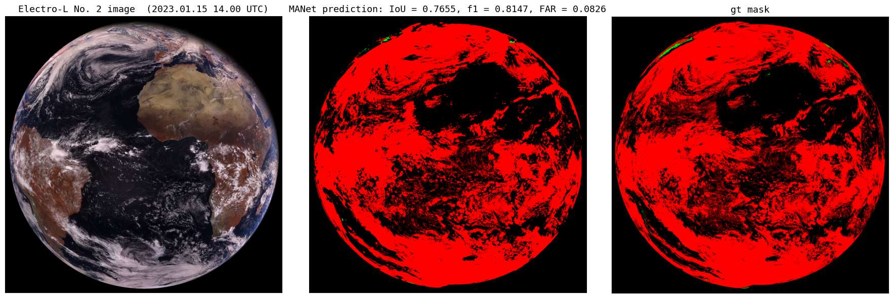

# Cloud and snow semantic segmentation for meteorological satellite Electro-L № 2 data #


## **About:**

This project is devoted to the cloud and snow semantic segmentation using multispectral satellite images, received from a multizone scanning instrument (MSU-GS) used for hydrometeorological support and installed on the Russian satellite Electro-L No. 2. As the additional information, geographical information (latitude, longitude and altitude) is used. The main difficulty of snow and cloud discrimination using Electro-L No. 2 data is the absence of SWIR channels in the range 1300-1600 nm, which are necessary for accurate snow & cloud distinction (NDSI tests). The repo includes a self-collected dataset with Electro-L No. 2 imagery, cloud masks for it from the geostationary satellites GOES-16 & Meteosat-10 and snow masks from Terra/MODIS. We also attach a trained Multi-Scale Attention Network (MANet) segmentation model weights (from SMP: https://smp.readthedocs.io/en/latest/models.html), able to do accurate segmentation of cloud ansd snow for MSU-GS data. The developed algorithm works in any season of the year during the daytime and is able to perform cloud and snow segmentation in real time mode for Electro-L No.2 and GOES-R data.

- This project has 2 folders: **RES_4_KM** & **RES_1_KM** as NN need to be fitted for each resolution from scratch
- Both **RES_4_KM** & **RES_1_KM** provide **INFERENCE.ipynb**, data for it, model's weights and instructions of usage in **README.MD**
- GOES-16 L2 products used for cloud masks were obtained from Amazon: 
  - https://home.chpc.utah.edu/~u0553130/Brian_Blaylock/cgi-bin/goes16_download.cgi?source=aws&satellite=noaa-goes16&domain=F&product=ABI-L2-MCMIP&date=2021-12-15&hour=12
- Meteosat-10 L2 products used for cloud masks were obtained from Eumetsat Store: 
  - https://navigator.eumetsat.int/product/EO:EUM:DAT:MSG:CLM?query=&amp;filter=coverage__Regional&results=89&filter=satellite__MSG&filter=processingLevel__Level%202%20Data&s=advanced
- Terra/MODIS daily snow maps for snow masks were obtained from:
  - https://neo.gsfc.nasa.gov/view.php?datasetId=MOD10C1_D_SNOW&date
- Electro-L №2 data can be obtained from Siberian Center of the Federal State Budgetary Institution Scientific Research Center of Space Hydrometeorology "Planeta". The data is available from the author upon request and with permission from https://en.rcpod.ru/.

## Setup python version
The **INFERENCE.ipynb** and other notebooks from both folders mentioned above have been run with `python 3.9.7` on Windows 10 OS with NVIDIA CUDA supported (Adapt all needed packages versions accroding your Python version)

### All required packages are written in requirements.txt
- It's recomended to use `Pytorch` version with CUDA support! To install pytorch with cuda run appropriate command in your console from here:
  - https://pytorch.org/get-started/locally/
  - (We used this version of cudann: `pip install torch==1.13.1+cu116 torchvision==0.14.1+cu116 torchaudio==0.13.1 --extra-index-url https://download.pytorch.org/whl/cu116`)
- There are seperated **requrements.txt** for each **.ipynb** in every folder in this repo! Be careful!
- Just run in your .ipynb this cell:
```
 !pip install -r requirements.txt
```
