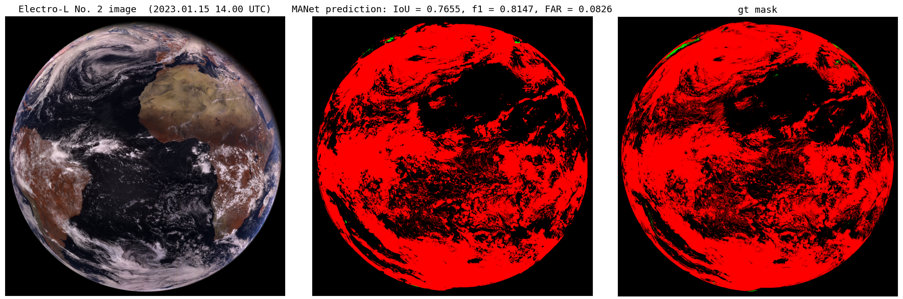

# Cloud and snow semantic segmentation using meteorological satellite Electro-L № 2 data #


## **About:**

This project is devoted to the cloud and snow semantic segmentation using multispectral satellite images, received from a multizone scanning instrument (MSU-GS) used for hydrometeorological support and installed on the Russian satellite Electro-L No. 2. As the additional information, geographical information (latitude, longitude and altitude) is used. The main difficulty of snow and cloud discrimination using Electro-L No. 2 data is the absence of spectral channels in the range 1300-1600 nm, which are necessary for accurate separation snow from cloud textures (NDSI tests). The results of this work include a self-collected dataset with Electro-L No. 2 imagery, cloud masks for it from the geostationary satellites GOES-16, Meteosat-10 and snow masks from Terra/MODIS. We also attach a trained Multi-Scale Attention Network (MANet) segmentation model weights (from SMP: https://smp.readthedocs.io/en/latest/models.html), able to do accurate segmentation of cloud ansd snow for MSU-GS multispectral data. The proposed  neural network for clouds and snow segmentation has been tested for different seasons and daytime periods with different level of illumination of images. The developed algorithm works in any season of the year during the daytime and is able to perform cloud and snow segmentation in real time mode for Electro-L No.2 and GOES-R data.

**Cite**: https://doi.org/10.1016/j.asr.2024.03.019

- Weights of model for Electro-L No.2 data can be loaded from **models** and used for data_inference in **INFERENCE.ipynb** as an example
- GOES-16 L2 products used for cloud masks were obtained from Amazon: 
  - https://home.chpc.utah.edu/~u0553130/Brian_Blaylock/cgi-bin/goes16_download.cgi?source=aws&satellite=noaa-goes16&domain=F&product=ABI-L2-MCMIP&date=2021-12-15&hour=12
- Meteosat-10 L2 products used for cloud masks were obtained from Eumetsat Store: 
  - https://navigator.eumetsat.int/product/EO:EUM:DAT:MSG:CLM?query=&amp;filter=coverage__Regional&results=89&filter=satellite__MSG&filter=processingLevel__Level%202%20Data&s=advanced
- Terra/MODIS daily snow maps for snow masks were obtained from:
  - https://neo.gsfc.nasa.gov/view.php?datasetId=MOD10C1_D_SNOW&date

## Setup python version
The **INFERENCE.ipynb** and other notebooks files have been run with `python 3.9.7` on Windows 10 OS with NVIDIA CUDA supported (Adapt all needed packages versions accroding your Python version)

### All required packages are written in requirements.txt
- It's recomended to use `Pytorch` version with CUDA support! To install pytorch with cuda run appropriate command in your console from here:
  - https://pytorch.org/get-started/locally/
  - (We used this version of cudann: `pip install torch==1.13.1+cu116 torchvision==0.14.1+cu116 torchaudio==0.13.1 --extra-index-url https://download.pytorch.org/whl/cu116`)
- There are seperated **requrements.txt** for each **.ipynb** in every folder in this repo! Be careful!
- Just run in your .ipynb this cell:
```
 !pip install -r requirements.txt
```
### INFERENCE.ipynb usage instructions:

- Clone this repo on your PC and run **INFERENCE.ipynb**
- At first cells we Import all required packages and set up random seeds 42 everywhere for stability and define your current directory and device: 
```
device = torch.device('cuda' if torch.cuda.is_available() else 'cpu')
your_current_dir = os.getcwd()
```
- Its recomended to use `CUDA` `device` instead of `CPU` to make the model working process faster
- After that you can simply press 'run all' in your jupyter notebook and wait for parsing all inference data and working the MANet model predicting through 144 patches to evaluate cloud and snow masks for half of Electro-L № 2 image
- Its recomended to use local PC for running `def merge_masks` as Google Colab slowly works with opening lots of files from your Google Drive content directories in a loop over 144 patches
- During splitting, `tqdm` progress bar will help you to follow the current progress stage 
- **ATTENTION!** Splitting all inference data requires about **1 GB** of free memory on your hard drive!
- In the last cell there is a visualization of ground truth masks, MANet model prediction and RGB image from Electro L2 with the metrics (FAR, IoU, F1) evaluation (can be modified for other metrics for Your needs)

### MANet_training folder usage instructions:

- This directory contains **MANet_training.ipynb** and **requirements.txt** for it with the full pipeline for successfull preprocessing multispectral data from Electro-L № 2 and training segmentation model on it via some tricks with `scheduler`, `optimizer` and `WeightedRandomSampler`
- **ATTENTION!** This notebooks requires from You to unpack inference data and split it to patches via **INFERENCE.ipynb** in advance!!!
- In this notebook as an example we use only 1 image from Electro-L № 2, which is situated in **data_inference folder** in that project (You won't be able to train segmentation model from scratch for good quality segmentation only on this 1 image! You can use pretrained models from this repo instead)
- This notebook can be used in 'run all' mode on data in **data_inference folder** from that repo and than adapted for your own generated dataset
- **PARSING_&_PROCESSING_SATELLITE_DATA_PUBLIC.ipynb** from **RES_1_KM folder** can help You to make your own big dataset of geostationary multispectral data with geoinfo and clouds, snow masks for your scientific research
- **There are lots of parameters, paths and names, that are hardcoded! Be careful with it!** You can adjust all these paths and parameters according Your needs. Training  parameters to tune are:
  - `learning rate`
  - `weight decay`
  - `max_epoch_num` (number of epochs to train your model)
  - `best_train_iou_` is a threshold IoU value on validation subset to save your first model during first training epochs
  - `scheduler` can be changed from `None` by default to alternative that You think is more effective
  - `Ranger21_optimizer` can be changed to classical `Adam/AdamW` or sth else (`SGD` etc.)
  - Your Loss function can be modified with gamma in FocalLoss (from SMP) and with beta in a linear combination of Dice and Focal Losses (from SMP)
- Optional part in the end of that .ipynb file includes function for souping several models weights, saved on different epochs during training process
- You can soup more or less than 3 models if You wish (it's recomended to soup less than 10 models and use `torch.optim.lr_scheduler.CosineAnealingLR` or `torch.optim.lr_scheduler.CosineAnnealingWarmRestarts` scheduler to save models during training loop in different local minima of Your Loss function)

## Contacts:

To ask more questions about that project, leave any recomendations, suggestions and feedback about that project and its code or get other multispectral data from Electro-L № 2 Dataset be free to contact Nikita Belyakov:
- Mail: MSUBelyakovNV@yandex.ru
- Telegram: https://t.me/workout2018
- VK: https://vk.com/merenobody
- Contact phone: +79166893836

## Acknowledgments:

**Work is greatly supported by Non-commercial Foundation for the Advancement of Science and Education INTELLECT**

Also thanks a lot to https://github.com/skolpin & https://github.com/VasilievArtyom for a huge assist for creating this project!

